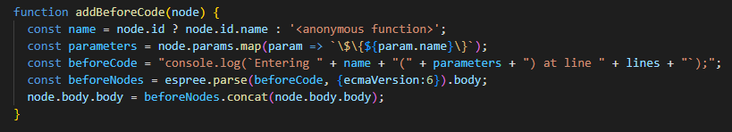

[](https://classroom.github.com/open-in-codespaces?assignment_repo_id=10358004)
# Práctica Espree logging

## Resumen de lo aprendido

En esta práctica hemos empleado conceptos nuevos como integración continua, que facilitaría el desarrollo del proyecto en caso de que se quisiese escalar mediante GitHub Actions.
```yml
name: CI

# Controls when the workflow will run
on:
  # Triggers the workflow on push or pull request events but only for the $default-branch branch
  push:
    branches: [ main ]
  pull_request:
    branches: [ main ]
...
```
<br><br>
Por otro lado también he aprendido a publicar un paquete en npm


<br><br>

También se han usado herramientas aprendidas anteriormente como commander, testing, creación de scripts en el package.json y coverage del código.
-------------------------

## Indicar los valores de los argumentos

Se ha modificado el código de `logging-espree.js` para que el log también indique los valores de los argumentos que se pasaron a la función. 
<br> 

*Ejemplo:* <br>

```javascript
function foo(a, b) {
  var x = 'blah';
  var y = (function (z) {
    return z+3;
  })(2);
}
foo(1, 'wut', 3);
```

```javascript
function foo(a, b) {
    console.log(`Entering foo(${ a }, ${ b })`);
    var x = 'blah';
    var y = function (z) {
        console.log(`Entering <anonymous function>(${ z })`);
        return z + 3;
    }(2);
}
foo(1, 'wut', 3);
```
<br>

-------------------------

## CLI con [Commander.js](https://www.npmjs.com/package/commander)

Se han añadido opciones -h y -V, que vienen reconocidas automáticamente con Commander, y una opción que permite especificar el fichero de salida.<br><br>

*Por ejemplo con -h:*<br>
 

<br>

*Con -V simplemente nos saldría el número de versión especificado en el package.json*

<br>

-------------------------

## Reto 1: Soportar funciones flecha

Para lograr que se puedan soportar este tipo de funciones ha sido necesario modificar la función *addLogging(code)*, incluyendo en el traverse los nodos de tipo *'ArrowFunctionExpression'*. Es importante mencionar que se le tiene que pasar una versión de *ecma* que soporte este tipo de funciones. (En este caso usaremos la versión 12 del estandar).

```javascript
export function addLogging(code) {
  var ast = espree.parse(code, {ecmaVersion: 12, loc: true});
  estraverse.traverse(ast, { /// Con traverse nos metemos en el árbol y buscamos que tipo de node es
    enter: function(node, parent) {
      if (node.type === 'FunctionDeclaration' ||
          node.type === 'ArrowFunctionExpression' ||
          node.type === 'FunctionExpression') {
            addBeforeCode(node);
          }
      }
    });
  return escodegen.generate(ast); /// Generamos el ast usando escodegen
}
```
-------------------------

## Reto 2: Añadir el número de línea

Usando una variable llamada *'lines'*, podemos obtener la propiedad del número de línea ya que cada nodo tiene una propiedad que contiene información sobre su localización en el código al principio del nodo. <br>

<br>

## Tests and Covering

Respecto al testing y cubrimiento, se ha implementado un test nuevo para comprobar la pero el resultado del coverage es un poco incongruente ya que el output de este aparece así:


pese a que debería pasar por las funciones que se mencionan en las lineas no recorridas para obtener el output.